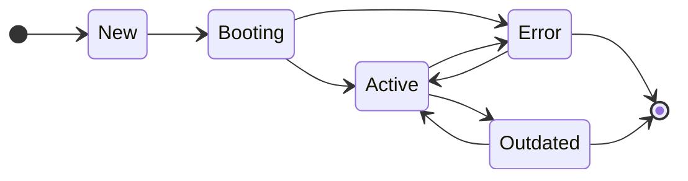

# Projectionist

The projectionist manages individual projectors and keeps the projections running.
Internally, the projectionist does this by tracking where each projection is in the event stream
and keeping all projections up to date.
He also takes care that new projections are booted and old ones are removed again.
If something breaks, the projectionist marks the individual projections as faulty.

!!! note

    You can find the basics of projections and projectors [here](./projection.md)

!!! tip

    The Projectionist was inspired by the following two blog posts:

    * [Projection Building Blocks: What you'll need to build projections](https://barryosull.com/blog/projection-building-blocks-what-you-ll-need-to-build-projections/)
    * [Managing projectors is harder than you think](https://barryosull.com/blog/managing-projectors-is-harder-than-you-think/)

## Versioned Projector

So that the projectionist can also assign the projectors to a projection,
the interface must be changed from `Projector` to `VersionedProjector`.
As the name suggests, the projector will also be versionable.

In addition, you have to implement the `targetProjection` method, which returns the target projection id.
So that several versions of the projection can exist,
the version of the projection should flow into the table or collection name.

```php
use Doctrine\DBAL\Connection;
use Patchlevel\EventSourcing\Attribute\Create;
use Patchlevel\EventSourcing\Attribute\Drop;
use Patchlevel\EventSourcing\Attribute\Handle;
use Patchlevel\EventSourcing\EventBus\Message;
use Patchlevel\EventSourcing\Projection\ProjectionId;
use Patchlevel\EventSourcing\Projection\Projectionist\VersionedProjector;

final class ProfileProjection implements VersionedProjector
{
    public function __construct(
        private readonly Connection $connection
    ) {
    }

    public function targetProjection(): ProjectionId
    {
        return new ProjectionId(
            name: 'profile',
            version: 1
        );
    }

    /**
     * @return list<array{id: string, name: string}>
     */
    public function getProfiles(): array
    {
        return $this->connection->fetchAllAssociative(
            sprintf('SELECT id, name FROM %s;', $this->table())
        );
    }

    #[Create]
    public function create(): void
    {
        $this->connection->executeStatement(
            sprintf(
                'CREATE TABLE IF NOT EXISTS %s (id VARCHAR PRIMARY KEY, name VARCHAR NOT NULL);',
                $this->table()
            )
        );
    }

    #[Drop]
    public function drop(): void
    {
        $this->connection->executeStatement(
            sprintf('DROP TABLE IF EXISTS %s;', $this->table())
        );
    }

    #[Handle(ProfileCreated::class)]
    public function handleProfileCreated(Message $message): void
    {
        $profileCreated = $message->event();

        $this->connection->executeStatement(
            sprintf('INSERT INTO %s (`id`, `name`) VALUES(:id, :name);', $this->table()),
            [
                'id' => $profileCreated->profileId,
                'name' => $profileCreated->name
            ]
        );
    }

    private function table(): string
    {
        return sprintf(
            'projection_%s_%s',
            $this->targetProjection()->name(),
            $this->targetProjection()->version()
        );
    }
}
```

## Projection Id

A projection id consists of a unique name and a version.
As soon as the projection changes, such as the structure or the data, the version of the projection must be incremented.
This tells the projectionist to build an another projection.

## Projection Position

Furthermore, the position in the event stream is noted for each projection.
So that the projectionist knows where the projection stopped and must continue.

## Projection Status

There is a lifecycle for each projection.
This cycle is tracked by the projectionist.



### New

A projection gets the status new if there is a projector with an unknown projection id.
This can happen when either a new projector has been added, the version has changed
or the projection has been manually deleted from the projection store.

### Booting

Booting status is reached when the boot process is invoked.
Then the new projections are built up in a separate process parallel.
As soon as the projection is built up to the current status, the status changes to active.

### Active

The active status describes the projections currently being actively managed by the projectionist.
These projections have a projector, follow the event stream and are up to date.

### Outdated

If a projection exists in the projection store
that does not have a projector in the source code with a corresponding projection id,
then this projection is marked as outdated.
This happens when either the projector has been deleted
or the projection id of a projector has changed.
In the last case there is a new projection.

An outdated projection does not automatically become active again when the projection id exists again.
This happens, for example, when an old version was deployed again during a rollback.

There are two options here:

- Reactivate the projection.
- Remove the projection and rebuild it from scratch.

### Error

If an error occurs in a projector, then the target projection is set to Error.
This projection will then no longer run until the projection is activated again.
There are two options here:

- Reactivate the projection.
- Remove the projection and rebuild it from scratch.

## Setup

In order for the projectionist to be able to do its work, you have to assemble it beforehand.

!!! warning

    The SyncProjectorListener must be removed again so that the events are not processed directly!

### Projection Store

In order for the projectionist to know the status and position of the projections, they must be saved.

Currently there is only the Doctrine Store.

```php
use Patchlevel\EventSourcing\Projection\Projection\Store\DoctrineStore;

$projectionStore = new DoctrineStore($connection);
```

So that the schema for the projection store can also be created,
we have to tell the `SchemaDirector` our schema configuration.
Using `ChainSchemaConfigurator` we can add multiple schema configurators.
In our case they need the `SchemaConfigurator` from the event store and projection store.

```php
use Patchlevel\EventSourcing\Schema\ChainSchemaConfigurator;
use Patchlevel\EventSourcing\Schema\DoctrineSchemaDirector;

$schemaDirector = new DoctrineSchemaDirector(
    $connection
    new ChainSchemaConfigurator([
        $eventStore,
        $projectionStore
    ]),
);
```

!!! note

    You can find more about schema configurator [here](./store.md)

### Projectionist

Now we can create the projectionist:

```php
use Patchlevel\EventSourcing\Projection\Projectionist\DefaultProjectionist;

$projectionist = new DefaultProjectionist(
    $eventStore,
    $projectionStore,
    $projectorRepository
);
```

## Usage

The Projectionist has a few methods needed to use it effectively. These are explained here:

### Boot

So that the projectionist can manage the projections, they must be booted.
In this step, the structures are created for all new projections.
The projections then catch up with the current position of the event stream.
When the projections are finished, they switch to the active state.

```php
$projectionist->boot();
```

### Run

All active projections are continued and updated here.

```php
$projectionist->run();
```

### Teardown

If projections are outdated, they can be cleaned up here.
The projectionist also tries to remove the structures created for the projection.

```php
$projectionist->teardown();
```

### Remove

You can also directly remove a projection regardless of its status.
An attempt is made to remove the structures, but the entry will still be removed if it doesn't work.

```php
$projectionist->remove();
```

### Reactivate

If a projection had an error, you can reactivate it.
As a result, the projection gets the status active again and is then kept up-to-date again by the projectionist.

```php
$projectionist->reactivate();
```

### Projections

To get the current status of all projections, you can get them using the `projections` method.

```php
$projections = $projectionist->projections();

foreach ($projections as $projection) {
    echo $projection->status();
}
```

!!! note

    There are also [cli commands](./cli.md) for all commands.
