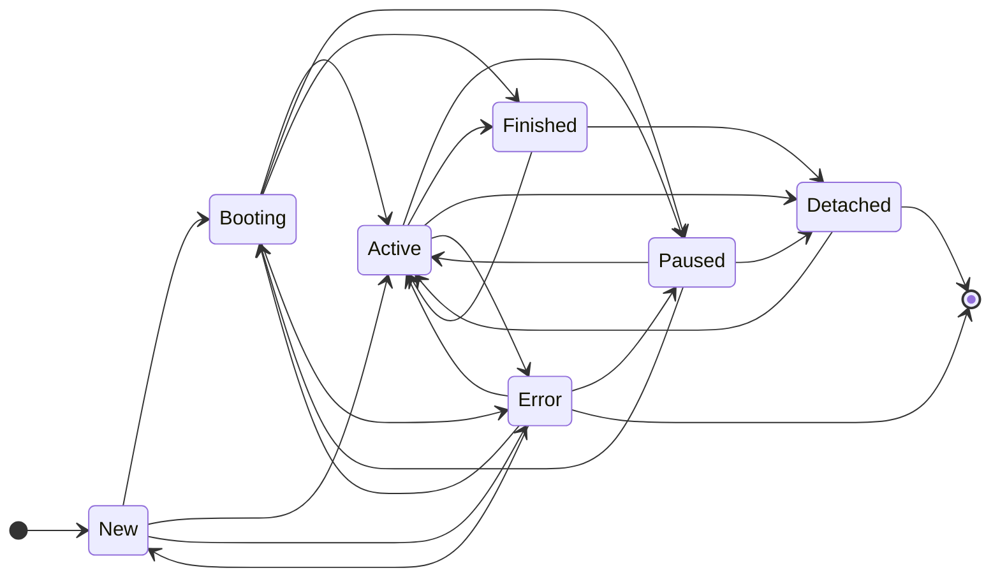

# Subscriptions

One core concept of event sourcing is the ability to react and process events in a different way.
This is where subscriptions and the subscription engine come into play.

There are different types of subscriptions. In most cases, we are talking about projector and processor.
But you can use it for anything like migration, report or something else.

For this, we use the event store to get the events and process them.
The event store remains untouched and everything can always be reproduced from the events.

The subscription engine manages individual subscribers and keeps the subscriptions running.
Internally, the subscription engine does this by tracking where each subscriber is in the event stream.

## Subscriber

If you want to react to events, you have to create a subscriber.
Each subscriber need a unique ID and a run mode.

```php
use Patchlevel\EventSourcing\Attribute\Subscriber;
use Patchlevel\EventSourcing\Subscription\RunMode;

#[Subscriber('do_stuff', RunMode::Once)]
final class DoStuffSubscriber
{
}
```
!!! note

    For each subsciber ID, the engine will create a subscription.
    If the subscriber ID changes, a new subscription will be created.
    In some cases like projections, you want to change the subscriber ID to rebuild the projection.
    
!!! tip

    You can use specific attributes for specific subscribers like `Projector` or `Processor`.
    So you don't have to define the group and run mode every time.
    
### Projector

You can create projections and read models with a subscriber.
We named this type of subscriber `projector`. But in the end it's the same.

```php
use Doctrine\DBAL\Connection;
use Patchlevel\EventSourcing\Attribute\Subscriber;
use Patchlevel\EventSourcing\Subscription\RunMode;

#[Subscriber('profile_1', RunMode::FromBeginning)]
final class ProfileProjector
{
    public function __construct(
        private readonly Connection $connection,
    ) {
    }
}
```
Mostly you want process the events from the beginning.
For this reason, it is also possible to use the `Projector` attribute.
It extends the `Subscriber` attribute with a default group and run mode.

```php
use Doctrine\DBAL\Connection;
use Patchlevel\EventSourcing\Attribute\Projector;

#[Projector('profile_1')]
final class ProfileProjector
{
    public function __construct(
        private readonly Connection $connection,
    ) {
    }
}
```
!!! warning

    MySQL and MariaDB don't support transactions for DDL statements.
    So you must use a different database connection for your subscriptions.
    
!!! note

    More about the projector and projections can be found [here](projection.md).
    
!!! tip

    Add a version as suffix to the subscriber id
    so you can increment it when the subscription changes.
    Like `profile_1` to `profile_2`.
    
### Processor

The other way to react to events is to take actions like sending an email, dispatch commands or change other aggregates.
We named this type of subscriber `processor`.

```php
use Patchlevel\EventSourcing\Attribute\Subscriber;
use Patchlevel\EventSourcing\Subscription\RunMode;

#[Subscriber('welcome_email', RunMode::FromNow)]
final class WelcomeEmailProcessor
{
    public function __construct(
        private readonly Mailer $mailer,
    ) {
    }
}
```
Mostly you want process the events from now,
because you don't want to email users who already have an account since a long time.

For this reason, it is also possible to use the `Processor` attribute.
It extends the `Subscriber` attribute with a default group and run mode.

```php
use Doctrine\DBAL\Connection;
use Patchlevel\EventSourcing\Attribute\Processor;

#[Processor('welcome_email')]
final class WelcomeEmailProcessor
{
    public function __construct(
        private readonly Connection $connection,
    ) {
    }
}
```
!!! note

    More about the processor can be found [here](processor.md).
    
### Subscribe

A subscriber (projector/processor) can subscribe any number of events.
In order to say which method is responsible for which event, you need the `Subscribe` attribute.
There you can pass the event class to which the reaction should then take place.
The method itself must expect a `Message`, which then contains the event.
The method name itself doesn't matter.

```php
use Patchlevel\EventSourcing\Attribute\Subscribe;
use Patchlevel\EventSourcing\Attribute\Subscriber;
use Patchlevel\EventSourcing\Message\Message;

#[Subscriber('do_stuff', RunMode::Once)]
final class DoStuffSubscriber
{
    #[Subscribe(ProfileCreated::class)]
    public function onProfileCreated(Message $message): void
    {
        $profileCreated = $message->event();

        // do something
    }
}
```
!!! note

    You can subscribe to multiple events on the same method or you can use "*" to subscribe to all events.
    More about this can be found [here](./event_bus.md#listener).
    
!!! tip

    If you are using psalm then you can install the event sourcing [plugin](https://github.com/patchlevel/event-sourcing-psalm-plugin) 
    to make the event method return the correct type.
    
### Setup and Teardown

Subscribers can have one `setup` and `teardown` method that is executed when the subscription is created or deleted.
For this there are the attributes `Setup` and `Teardown`. The method name itself doesn't matter.
This is especially helpful for projectors, as they can create the necessary structures for the projection here.

```php
use Patchlevel\EventSourcing\Attribute\Projector;
use Patchlevel\EventSourcing\Attribute\Setup;
use Patchlevel\EventSourcing\Attribute\Teardown;
use Patchlevel\EventSourcing\Subscription\Subscriber\SubscriberUtil;

#[Projector('profile_1')]
final class ProfileProjector
{
    use SubscriberUtil;

    // ...

    #[Setup]
    public function create(): void
    {
        $this->connection->executeStatement(
            "CREATE TABLE IF NOT EXISTS {$this->table()} (id VARCHAR PRIMARY KEY, name VARCHAR NOT NULL);",
        );
    }

    #[Teardown]
    public function drop(): void
    {
        $this->connection->executeStatement("DROP TABLE IF EXISTS {$this->table()};");
    }

    private function table(): string
    {
        return 'projection_' . $this->subscriberId();
    }
}
```
!!! danger

    MySQL and MariaDB don't support transactions for DDL statements.
    So you must use a different database connection in your projectors, 
    otherwise you will get an error when the subscription tries to create the table.
    
!!! warning

    If you change the subscriber id, you must also change the table/collection name.
    The subscription engine will create a new subscription with the new subscriber id.
    That means the setup method will be called again and the table/collection will conflict with the old existing projection.
    You can use the `SubscriberUtil` to build the table/collection name.
    
!!! note

    Most databases have a limit on the length of the table/collection name.
    The limit is usually 64 characters.
    
### Versioning

As soon as the structure of a projection changes, or you need other events from the past,
you can change the subscriber ID to rebuild the projection.
This will trigger the subscription engine to create a new subscription and boot the projection from the beginning.

```php
use Patchlevel\EventSourcing\Attribute\Projector;

#[Projector('profile_2')]
final class ProfileSubscriber
{
   // ...
}
```
!!! warning

    If you change the `subscriberID`, you must also change the table/collection name.
    Otherwise the table/collection will conflict with the old subscription.
    
!!! tip

    Add a version as suffix to the subscriber id
    so you can increment it when the subscription changes.
    Like `profile_1` to `profile_2`.
    
### Grouping

You can also group subscribers together and filter them in the subscription engine.
This is useful if you want to run subscribers in different processes or on different servers.

```php
use Patchlevel\EventSourcing\Attribute\Subscriber;

#[Subscriber('profile_1', group: 'a')]
final class ProfileSubscriber
{
   // ...
}
```
!!! note

    The different attributes has different default group.
    
    * `Subscriber` - `default`
    * `Projector` - `projector`
    * `Processor` - `processor`
    
### Run Mode

The run mode determines how the subscriber should behave.
There are three different modes:

#### From Beginning

The subscriber will start from the beginning of the event stream and process all events.
This is useful for subscribers that need to build up a projection from scratch.

```php
use Patchlevel\EventSourcing\Attribute\Subscriber;
use Patchlevel\EventSourcing\Subscription\RunMode;

#[Subscriber('welcome_email', RunMode::FromBeginning)]
final class WelcomeEmailSubscriber
{
   // ...
}
```
!!! tip

    If you want create projections and run from the beginning, you can use the `Projector` attribute.
    
#### From Now

Certain subscribers operate exclusively on post-release events, disregarding historical data.
This is useful for subscribers that are only interested in events that occur after a certain point in time.
As example, a welcome email subscriber that only wants to send emails to new users.

```php
use Patchlevel\EventSourcing\Attribute\Subscriber;
use Patchlevel\EventSourcing\Subscription\RunMode;

#[Subscriber('welcome_email', RunMode::FromNow)]
final class WelcomeEmailSubscriber
{
   // ...
}
```
!!! tip

    If you want process events from now, you can use the `Processor` attribute.
    
#### Once

This mode is useful for subscribers that only need to run once.
This is useful for subscribers to create reports or to migrate data.

```php
use Patchlevel\EventSourcing\Attribute\Subscriber;
use Patchlevel\EventSourcing\Subscription\RunMode;

#[Subscriber('migration', RunMode::Once)]
final class MigrationSubscriber
{
   // ...
}
```
## Subscription Engine

The subscription engine manages individual subscribers and keeps the subscriptions running.
Internally, the subscription engine does this by tracking where each subscriber is in the event stream
and keeping all subscriptions up to date.

He also takes care that new subscribers are booted and old ones are removed again.
If something breaks, the subscription engine marks the individual subscriptions as faulty and retries them.

!!! tip

    The Subscription Engine was inspired by the following two blog posts:
    
    * [Projection Building Blocks: What you'll need to build projections](https://barryosull.com/blog/projection-building-blocks-what-you-ll-need-to-build-projections/)
    * [Managing projectors is harder than you think](https://barryosull.com/blog/managing-projectors-is-harder-than-you-think/)
    
## Subscription ID

The subscription ID is taken from the associated subscriber and corresponds to the subscriber ID.
Unlike the subscriber ID, the subscription ID can no longer change.
If the Subscriber ID is changed, a new subscription will be created with this new subscriber ID.
So there are two subscriptions, one with the old subscriber ID and one with the new subscriber ID.

## Subscription Position

Furthermore, the position in the event stream is stored for each subscription.
So that the subscription engine knows where the subscription stopped and must continue.

## Subscription Status

There is a lifecycle for each subscription.
This cycle is tracked by the subscription engine.


### New

A subscription is created and "new" if a subscriber exists with an ID that is not yet tracked.
This can happen when either a new subscriber has been added, the subscriber ID has changed
or the subscription has been manually deleted from the subscription store.
You can then set up the subscription so that it is booting or active.
In this step, the subscription engine also tries to call the `setup` method if available.

### Booting

Booting status is reached when the setup process is finished.
In this step the subscription engine tries to catch up to the current event stream.
When the process is finished, the subscription is set to active or finished.

### Active

The active status describes the subscriptions currently being actively managed by the subscription engine.
These subscriptions have a subscriber, follow the event stream and should be up-to-date.

## Paused

A subscription can manually be paused. It will then no longer be updated by the subscription engine.
This can be useful if you want to pause a subscription for a certain period of time.
You can also reactivate the subscription if you want so that it continues.

### Finished

A subscription is finished if the subscriber has the mode `RunMode::Once`.
This means that the subscription is only run once and then set to finished if it reaches the end of the event stream.
You can also reactivate the subscription if you want so that it continues.

### Detached

If an active or finished subscription exists in the subscription store
that does not have a subscriber in the source code with a corresponding subscriber ID,
then this subscription is marked as detached.
This happens when either the subscriber has been deleted
or the subscriber ID of a subscriber has changed.
In the last case there should be a new subscription with the new subscriber ID.

A detached subscription does not automatically become active again when the subscriber exists again.
This happens, for example, when an old version was deployed again during a rollback.

There are two options to reactivate the subscription:

* Reactivate the subscription, so that the subscription is active again.
* Remove the subscription and rebuild it from scratch.

### Error

If an error occurs in a subscriber, then the subscription is set to Error.
This can happen in the create process, in the boot process or in the run process.
This subscription will then no longer boot/run until the subscription is reactivate or retried.

The subscription engine has a retry strategy to retry subscriptions that have failed.
It tries to reactivate the subscription after a certain time and a certain number of attempts.
If this does not work, the subscription is set to error and must be manually reactivated.

There are two options here:

* Reactivate the subscription, so that the subscription is in the previous state again.
* Remove the subscription and rebuild it from scratch.

## Setup

In order for the subscription engine to be able to do its work, you have to assemble it beforehand.

### Subscription Store

The Subscription Engine uses a subscription store to store the status of each subscription.
We provide a Doctrine implementation of this by default.

```php
use Patchlevel\EventSourcing\Subscription\Store\DoctrineSubscriptionStore;

$subscriptionStore = new DoctrineSubscriptionStore($connection);
```
So that the schema for the subscription store can also be created,
we have to tell the `DoctrineSchemaDirector` our schema configuration.
Using `ChainDoctrineSchemaConfigurator` we can add multiple schema configurators.
In our case they need the `DoctrineSchemaDirector` from the event store and subscription store.

```php
use Patchlevel\EventSourcing\Schema\ChainDoctrineSchemaConfigurator;
use Patchlevel\EventSourcing\Schema\DoctrineSchemaDirector;

$schemaDirector = new DoctrineSchemaDirector(
    $connection,
    new ChainDoctrineSchemaConfigurator([
        $eventStore,
        $subscriptionStore,
    ]),
);
```
!!! note

    You can find more about schema configurator [here](./store.md) 
    
### Retry Strategy

The subscription engine uses a retry strategy to retry subscriptions that have failed.
Our default strategy can be configured with the following parameters:

* `baseDelay` - The base delay in seconds.
* `delayFactor` - The factor by which the delay is multiplied after each attempt.
* `maxAttempts` - The maximum number of attempts.

```php
use Patchlevel\EventSourcing\Subscription\RetryStrategy\ClockBasedRetryStrategy;

$retryStrategy = new ClockBasedRetryStrategy(
    baseDelay: 5,
    delayFactor: 2,
    maxAttempts: 5,
);
```
!!! tip

    You can reactivate the subscription manually or remove it and rebuild it from scratch.
    
### Subscriber Accessor

The subscriber accessor repository is responsible for providing the subscribers to the subscription engine.
We provide a metadata subscriber accessor repository by default.

```php
use Patchlevel\EventSourcing\Subscription\Subscriber\MetadataSubscriberAccessorRepository;

$subscriberAccessorRepository = new MetadataSubscriberAccessorRepository([$subscriber1, $subscriber2, $subscriber3]);
```
### Subscription Engine

Now we can create the subscription engine and plug together the necessary services.
The event store is needed to load the events, the Subscription Store to store the subscription state
and we need the subscriber accessor repository. Optionally, we can also pass a retry strategy.

```php
use Patchlevel\EventSourcing\Subscription\Engine\DefaultSubscriptionEngine;

$subscriptionEngine = new DefaultSubscriptionEngine(
    $eventStore,
    $subscriptionStore,
    $subscriberAccessorRepository,
    $retryStrategy,
);
```
## Usage

The Subscription Engine has a few methods needed to use it effectively.
A `SubscriptionEngineCriteria` can be passed to all of these methods to filter the respective subscriptions.

```php
use Patchlevel\EventSourcing\Subscription\Engine\SubscriptionEngineCriteria;

$criteria = new SubscriptionEngineCriteria(
    ids: ['profile_1', 'welcome_email'],
    groups: ['default'],
);
```
!!! note

    An `OR` check is made for the respective criteria and all criteria are checked with an `AND`.
    
### Setup

New subscriptions need to be set up before they can be used.
In this step, the subscription engine also tries to call the `setup` method if available.
After the setup process, the subscription is set to booting or active.

```php
$subscriptionEngine->setup($criteria);
```
!!! tip

    You can skip the booting step with the second boolean parameter named `skipBooting`.
    
### Boot

You can boot the subscriptions with the `boot` method.
All booting subscriptions will catch up to the current event stream.
After the boot process, the subscription is set to active or finished.

```php
$subscriptionEngine->boot($criteria);
```
### Run

All active subscriptions are continued and updated here.

```php
$subscriptionEngine->run($criteria);
```
### Teardown

If subscriptions are detached, they can be cleaned up here.
The subscription engine also tries to call the `teardown` method if available.

```php
$subscriptionEngine->teardown($criteria);
```
### Remove

You can also directly remove a subscription regardless of its status.
An attempt is made to call the `teardown` method if available.
But the entry will still be removed if it doesn't work.

```php
$subscriptionEngine->remove($criteria);
```
### Reactivate

If a subscription had an error or is outdated, you can reactivate it.
As a result, the subscription gets in the last status again.

```php
$subscriptionEngine->reactivate($criteria);
```
### Pause

Pausing a subscription is also possible.
The subscription will then no longer be managed by the subscription engine.
You can reactivate the subscription if you want so that it continues.

```php
$subscriptionEngine->pause($criteria);
```
### Status

To get the current status of all subscriptions, you can get them using the `subscriptions` method.

```php
$subscriptions = $subscriptionEngine->subscriptions($criteria);

foreach ($subscriptions as $subscription) {
    echo $subscription->status();
}
```
## Learn more

* [How to use CLI commands](./cli.md)
* [How to use Pipeline](./pipeline.md)
* [How to use Event Bus](./event_bus.md)
* [How to Test](./testing.md)
