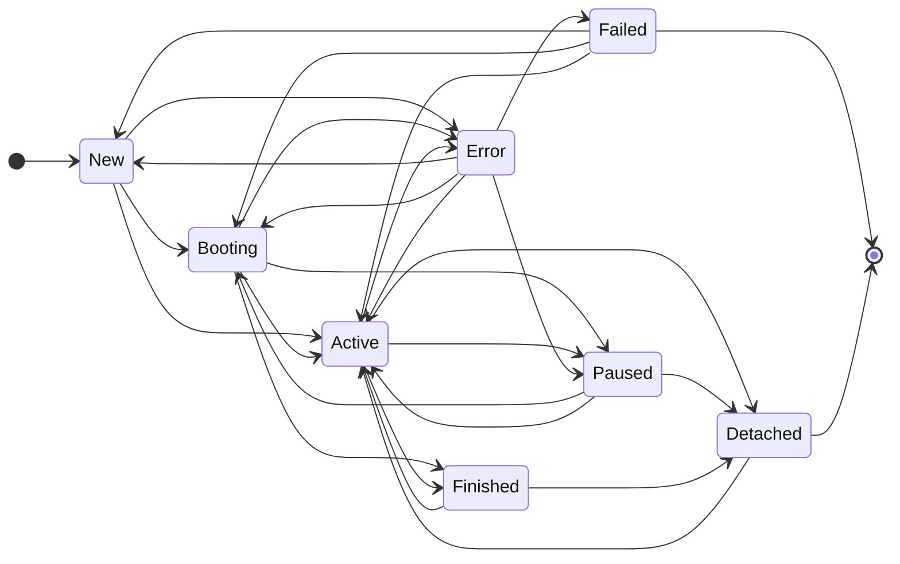

# Subscriptions

One core concept of event sourcing is the ability to react and process events in a different way.
This is where subscriptions and the subscription engine come into play.

There are different types of subscriptions. In most cases, we are talking about projectors and processors.
But you can use it for anything like migration, report or something else.

For this, we use the event store to get the events and process them.
The event store remains untouched and everything can always be reproduced from the events.

The subscription engine manages individual subscribers and keeps the subscriptions running.
Internally, the subscription engine does this by tracking where each subscriber is in the event stream.

## Subscriber

If you want to react to events, you have to create a subscriber.
Each subscriber needs a unique ID and a run mode.

```php
use Patchlevel\EventSourcing\Attribute\Subscriber;
use Patchlevel\EventSourcing\Subscription\RunMode;

#[Subscriber('do_stuff', RunMode::Once)]
final class DoStuffSubscriber
{
}
```
:::note
For each subscriber ID, the engine will create a subscription.
If the subscriber ID changes, a new subscription will be created.
In some cases like projections, you want to change the subscriber ID to rebuild the projection.
:::

:::tip
You can use specific attributes for specific subscribers like `Projector` or `Processor`.
So you don't have to define the group and run mode every time.
:::

### Projector

You can create projections and read models with a subscriber.
We named this type of subscriber `projector`. But in the end it's the same.

```php
use Doctrine\DBAL\Connection;
use Patchlevel\EventSourcing\Attribute\Subscriber;
use Patchlevel\EventSourcing\Subscription\RunMode;

#[Subscriber('profile_1', RunMode::FromBeginning)]
final class ProfileProjector
{
    public function __construct(
        private readonly Connection $connection,
    ) {
    }
}
```
Mostly you want to process the events from the beginning.
For this reason, it is also possible to use the `Projector` attribute.
It extends the `Subscriber` attribute with a default group and run mode.

```php
use Doctrine\DBAL\Connection;
use Patchlevel\EventSourcing\Attribute\Projector;

#[Projector('profile_1')]
final class ProfileProjector
{
    public function __construct(
        private readonly Connection $connection,
    ) {
    }
}
```
:::warning
PostgreSQL, MySQL and MariaDB don't support transactions for DDL statements.
So you must use a different database connection for your subscriptions.
:::

:::tip
Add a version as suffix to the subscriber id
so you can increment it when the subscription changes.
Like `profile_1` to `profile_2`.
:::

### Processor

The other way to react to events is to take actions like sending an email, dispatch commands or change other aggregates.
We named this type of subscriber `processor`.

```php
use Patchlevel\EventSourcing\Attribute\Subscriber;
use Patchlevel\EventSourcing\Subscription\RunMode;

#[Subscriber('welcome_email', RunMode::FromNow)]
final class WelcomeEmailProcessor
{
    public function __construct(
        private readonly Mailer $mailer,
    ) {
    }
}
```
Mostly you want to process the events from now,
because you don't want to email users who already have an account for a long time.

For this reason, it is also possible to use the `Processor` attribute.
It extends the `Subscriber` attribute with a default group and run mode.

```php
use Doctrine\DBAL\Connection;
use Patchlevel\EventSourcing\Attribute\Processor;

#[Processor('welcome_email')]
final class WelcomeEmailProcessor
{
    public function __construct(
        private readonly Connection $connection,
    ) {
    }
}
```
### Subscribe

A subscriber (projector/processor) can subscribe any number of events.
In order to say which method is responsible for which event, you need the `Subscribe` attribute.
There you can pass the event class to which the reaction should then take place.
The method itself must expect a `Message`, which then contains the event.
The method name itself doesn't matter.

```php
use Patchlevel\EventSourcing\Attribute\Subscribe;
use Patchlevel\EventSourcing\Attribute\Subscriber;
use Patchlevel\EventSourcing\Message\Message;
use Patchlevel\EventSourcing\Subscription\RunMode;

#[Subscriber('do_stuff', RunMode::Once)]
final class DoStuffSubscriber
{
    #[Subscribe(ProfileCreated::class)]
    public function onProfileCreated(Message $message): void
    {
        $profileCreated = $message->event();

        // do something
    }
}
```
:::tip
If you are using psalm then you can install the event sourcing [plugin](https://github.com/patchlevel/event-sourcing-psalm-plugin)
to make the event method return the correct type.
:::

### Subscribe all events

If you want to subscribe on all events, you can pass `*` or `Subscribe::ALL` instead of the event class.

```php
use Patchlevel\EventSourcing\Attribute\Subscribe;
use Patchlevel\EventSourcing\Attribute\Subscriber;
use Patchlevel\EventSourcing\Message\Message;
use Patchlevel\EventSourcing\Subscription\RunMode;

#[Subscriber('welcome_email', RunMode::FromNow)]
final class WelcomeSubscriber
{
    #[Subscribe('*')]
    public function onProfileCreated(Message $message): void
    {
        echo 'Welcome!';
    }
}
```
#### Argument Resolver

The library analyses the method signature and tries to resolve the arguments.
The order of the arguments doesn't matter, you can use multiple arguments and mix them.

##### Message Resolver

The message resolver resolves the `Message` object.
It looks for a parameter with the type `Message`.

```php
use Patchlevel\EventSourcing\Attribute\Subscribe;
use Patchlevel\EventSourcing\Attribute\Subscriber;
use Patchlevel\EventSourcing\Message\Message;
use Patchlevel\EventSourcing\Subscription\RunMode;

#[Subscriber('do_stuff', RunMode::Once)]
final class DoStuffSubscriber
{
    #[Subscribe(ProfileCreated::class)]
    public function onProfileCreated(Message $message): void
    {
        // do something
    }
}
```
##### Event Resolver

The event resolver resolves the event object.
It looks for a parameter with the type of the event.

```php
use Patchlevel\EventSourcing\Attribute\Subscribe;
use Patchlevel\EventSourcing\Attribute\Subscriber;
use Patchlevel\EventSourcing\Subscription\RunMode;

#[Subscriber('do_stuff', RunMode::Once)]
final class DoStuffSubscriber
{
    #[Subscribe(ProfileCreated::class)]
    public function onProfileCreated(ProfileCreated $profileCreated): void
    {
        // do something
    }
}
```
##### Lookup Resolver

Sometimes you need to query previous events to build a projection.
For this you can use the `Lookup` service.
This service only has access to the messages before the current message.
Here is an example how you can use it in a projector.

```php
use Patchlevel\EventSourcing\Attribute\Projector;
use Patchlevel\EventSourcing\Attribute\Subscribe;
use Patchlevel\EventSourcing\Message\Message;
use Patchlevel\EventSourcing\Message\Reducer;
use Patchlevel\EventSourcing\Subscription\Lookup\Lookup;

#[Projector('public_profile')]
final class PublicProfileProjection
{
    // ... constructor

    #[Subscribe(Published::class)]
    public function onPublished(Lookup $lookup): void
    {
        $messages = $lookup
            ->currentAggregate() // or ->currentStream() for StreamStore
            ->events(
                ProfileCreated::class,
                ProfileNameChanged::class,
            )->fetchAll();

        $state = (new Reducer())
            ->initState([
                'id' => null,
                'name' => null,
            ])
            ->match([
                ProfileCreated::class => static function (Message $message): array {
                    return [
                        'id' => $message->event()->id->toString(),
                        'name' => $message->event()->name,
                    ];
                },
                ProfileNameChanged::class => static function (Message $message, array $prevState): array {
                    return array_merge($prevState, [
                        'name' => $message->event()->name,
                    ]);
                },
            ])
            ->reduce($messages);

        $this->connection->insert('public_profile', $state);
    }

    // ... setup, teardown, ...
}
```
:::note
More information can be found in the [reducer](message.md#reducer) documentation.
:::

##### Recorded On Resolver

The recorded on resolver resolves the recorded on date.
It looks for a parameter with the type `DateTimeImmutable`.

```php
use Patchlevel\EventSourcing\Attribute\Subscribe;
use Patchlevel\EventSourcing\Attribute\Subscriber;
use Patchlevel\EventSourcing\Subscription\RunMode;

#[Subscriber('do_stuff', RunMode::Once)]
final class DoStuffSubscriber
{
    #[Subscribe(ProfileCreated::class)]
    public function onProfileCreated(DateTimeImmutable $recordedOn): void
    {
        // do something
    }
}
```
##### Custom Resolvers

You can provide your own argument resolvers by implementing the `ArgumentResolver` interface.
This can be useful for providing direct access to custom headers or other data.

### Setup

Subscribers can have one `setup` method that is executed when the subscription is created.
For this there is the attribute `Setup`. The method name itself doesn't matter.
This is especially helpful for projectors, as they can create the necessary structures for the projection here.

```php
use Doctrine\DBAL\Connection;
use Patchlevel\EventSourcing\Attribute\Projector;
use Patchlevel\EventSourcing\Attribute\Setup;

#[Projector(self::TABLE)]
final class ProfileProjector
{
    private const TABLE = 'profile_v1';

    private Connection $connection;

    #[Setup]
    public function create(): void
    {
        $this->connection->executeStatement(
            sprintf('CREATE TABLE IF NOT EXISTS %s (id VARCHAR PRIMARY KEY, name VARCHAR NOT NULL);', self::TABLE),
        );
    }
}
```
:::danger
PostgreSQL, MySQL and MariaDB don't support transactions for DDL statements.
So you must use a different database connection in your projectors,
otherwise you will get an error when the subscription tries to create the table.
:::

:::warning
If you change the subscriber id, you must also change the table/collection name.
The subscription engine will create a new subscription with the new subscriber id.
That means the setup method will be called again and the table/collection will conflict with the old existing projection.
:::

:::note
Most databases have a limit on the length of the table/collection name.
The limit is usually 64 characters.
:::

### Teardown

Subscribers can have one `teardown` method that is executed when the subscription is removed.
For this there is the attribute `Teardown`.

```php
use Doctrine\DBAL\Connection;
use Patchlevel\EventSourcing\Attribute\Projector;
use Patchlevel\EventSourcing\Attribute\Teardown;

#[Projector(self::TABLE)]
final class ProfileProjector
{
    private const TABLE = 'profile_v1';

    private Connection $connection;

    #[Teardown]
    public function drop(): void
    {
        $this->connection->executeStatement(sprintf('DROP TABLE IF EXISTS %s;', self::TABLE));
    }
}
```
:::danger
PostgreSQL, MySQL and MariaDB don't support transactions for DDL statements.
So you must use a different database connection in your projectors,
otherwise you will get an error when the subscription tries to create the table.
:::

:::warning
A teardown can only be performed for a subscription if the code for the subscriber with that subscriber ID still exists.
Another option is to use the `Cleanup` method.
:::

:::note
You can not mix the `cleanup` method with the `teardown` method.
:::

### Cleanup

Alternatively, you can use a `cleanup` method for cleanup tasks.
Unlike Teardown, this method is called when the subscription is created.
The tasks are then saved in the Subscription Store.
When removing the subscription, the subscriber is not necessary anymore,
as the cleanup can be performed using the tasks in the store and an associated external handler.

```php
use Doctrine\DBAL\Connection;
use Patchlevel\EventSourcing\Attribute\Cleanup;
use Patchlevel\EventSourcing\Attribute\Projector;
use Patchlevel\EventSourcing\Subscription\Cleanup\Dbal\DropIndexTask;

#[Projector(self::TABLE)]
final class ProfileProjector
{
    private const TABLE = 'profile_v1';

    private Connection $connection;

    #[Cleanup]
    public function drop(): array
    {
        return [new DropIndexTask(self::TABLE)];
    }
}
```
:::note
You can not mix the `cleanup` method with the `teardown` method.
:::

#### Dbal Cleanup Tasks

By default, we provide the following cleanup tasks for `doctrine/dbal`:

| Task            | Description                  |
|-----------------|------------------------------|
| `DropIndexTask` | Drops an index from a table. |
| `DropTableTask` | Drops a table.               |

:::note
If you are passing connection registry, you can use the connection name as parameter.
The `connectionName` parameter is optional and defaults to the default connection.
:::

:::tip
You can create your own cleanup tasks and handler.
For more information, see [Cleanup Handler](#cleanup-handler).
:::

### On Failed

The subscription engine has a [retry strategy](#retry-strategy) to retry subscriptions that have an error.
If this does not work, the subscription changes the status to failed and will be ignored in all future runs.
You can react to this transition and prevent it, so the subscription can skip the message and continue with the next one.
To do this, you can add a method with the `OnFailed` attribute.
If the method throws an exception, the subscription will be set to failed,
otherwise the subscription will continue with the next message.

```php
use Patchlevel\EventSourcing\Attribute\OnFailed;
use Patchlevel\EventSourcing\Attribute\Processor;
use Patchlevel\EventSourcing\Attribute\Subscribe;
use Patchlevel\EventSourcing\Message\Message;

#[Processor('invoice')]
final class InvoiceProcessor
{
    #[Subscribe(OrderPlaced::class)]
    public function onOrderPlaced(OrderPlaced $orderPlaced): void
    {
        // an error occurs
    }

    #[OnFailed]
    public function onFailed(Message $message, Throwable $throwable): void
    {
        // do something (failed queue, logging, etc.), so the subscription can continue
    }
}
```
:::warning
Currently, the `OnFailed` method is only available for non-batchable subscribers.
:::

:::note
The `OnFailed` method is called after the retry strategy has decided that the subscription should be set to failed.
:::

### Versioning

As soon as the structure of a projection changes, or you need other events from the past,
you can change the subscriber ID to rebuild the projection.
This will trigger the subscription engine to create a new subscription and boot the projection from the beginning.

```php
use Patchlevel\EventSourcing\Attribute\Projector;

#[Projector('profile_2')]
final class ProfileSubscriber
{
   // ...
}
```
:::warning
If you change the `subscriberID`, you must also change the table/collection name.
Otherwise the table/collection will conflict with the old subscription.
:::

:::tip
Add a version as suffix to the subscriber id
so you can increment it when the subscription changes.
Like `profile_1` to `profile_2`.
:::

### Grouping

You can also group subscribers together and filter them in the subscription engine.
This is useful if you want to run subscribers in different processes or on different servers.

```php
use Patchlevel\EventSourcing\Attribute\Subscriber;
use Patchlevel\EventSourcing\Subscription\RunMode;

#[Subscriber('profile_1', runMode: RunMode::Once, group: 'a')]
final class ProfileSubscriber
{
   // ...
}
```
:::note
The different attributes have different default groups.

* `Subscriber` - `default`
* `Projector` - `projector`
* `Processor` - `processor`
  :::

### Run Mode

The run mode determines how the subscriber should behave.
There are three different modes:

#### From Beginning

The subscriber will start from the beginning of the event stream and process all events.
This is useful for subscribers that need to build up a projection from scratch.

```php
use Patchlevel\EventSourcing\Attribute\Subscriber;
use Patchlevel\EventSourcing\Subscription\RunMode;

#[Subscriber('welcome_email', RunMode::FromBeginning)]
final class WelcomeEmailSubscriber
{
   // ...
}
```
:::tip
If you want to create projections and run from the beginning, you can use the `Projector` attribute.
:::

#### From Now

Certain subscribers operate exclusively on post-release events, disregarding historical data.
This is useful for subscribers that are only interested in events that occur after a certain point in time.
As example, a welcome email subscriber that only wants to send emails to new users.

```php
use Patchlevel\EventSourcing\Attribute\Subscriber;
use Patchlevel\EventSourcing\Subscription\RunMode;

#[Subscriber('welcome_email', RunMode::FromNow)]
final class WelcomeEmailSubscriber
{
   // ...
}
```
:::tip
If you want to process events from now, you can use the `Processor` attribute.
:::

#### Once

This mode is useful for subscribers that only need to run once.
This is useful for subscribers to create reports or to migrate data.

```php
use Patchlevel\EventSourcing\Attribute\Subscriber;
use Patchlevel\EventSourcing\Subscription\RunMode;

#[Subscriber('migration', RunMode::Once)]
final class MigrationSubscriber
{
   // ...
}
```
### Select Retry Strategy

You can select a retry strategy for your subscriber.
We preconfigured two strategies for you: `default` and `no_retry`.

* `default` - The default strategy retries the subscription 5 times.
* `no_retry` - The no retry strategy does not retry the subscription.

```php
use Patchlevel\EventSourcing\Attribute\RetryStrategy;
use Patchlevel\EventSourcing\Attribute\Subscribe;
use Patchlevel\EventSourcing\Attribute\Subscriber;
use Patchlevel\EventSourcing\Message\Message;
use Patchlevel\EventSourcing\Subscription\RunMode;

#[Subscriber('welcome_email', RunMode::FromNow)]
#[RetryStrategy('default')]
final class WelcomeSubscriber
{
    #[Subscribe('*')]
    public function onProfileCreated(Message $message): void
    {
        echo 'Welcome!';
    }
}
```
You can configure or add more strategies if you want.
For more information, see the [retry strategy](#retry-strategy) documentation.

### Batching

You can also optimize the performance of your subscribers by processing a number of events in a batch.
This is particularly useful when projections need to be rebuilt.
To achieve this, you can implement the `BatchableSubscriber` interface.

```php
use Doctrine\DBAL\Connection;
use Patchlevel\EventSourcing\Attribute\Projector;
use Patchlevel\EventSourcing\Attribute\Subscribe;
use Patchlevel\EventSourcing\Subscription\Subscriber\BatchableSubscriber;

#[Projector('profile_1')]
final class MigrationSubscriber implements BatchableSubscriber
{
    public function __construct(
        private readonly Connection $connection,
    ) {
    }

    /** @var array<string, int> */
    private array $nameChanged = [];

    #[Subscribe(NameChanged::class)]
    public function handleNameChanged(NameChanged $event): void
    {
        $this->nameChanged[$event->userId] = $event->name;
    }

    public function beginBatch(): void
    {
        $this->nameChanged = [];
        $this->connection->beginTransaction();
    }

    public function commitBatch(): void
    {
        foreach ($this->nameChanged as $userId => $name) {
            $this->connection->executeStatement(
                'UPDATE user SET name = :name WHERE id = :id',
                ['name' => $name, 'id' => $userId],
            );
        }

        $this->connection->commit();
        $this->nameChanged = [];
    }

    public function rollbackBatch(): void
    {
        $this->connection->rollBack();
    }

    public function forceCommit(): bool
    {
        return count($this->nameChanged) > 1000;
    }
}
```
This interface provides you with all the options you need to process your data collectively.

The `beginBatch` method is called as soon as a subscriber wants to process an event.
If no suitable event is found in the stream, batching will not start, and this method will not be called.
Here, you can make all necessary preparations, such as opening a transaction or preparing variables.

The `commitBatch` method is called when batching was previously started, and one of the following conditions is met:
Either the Subscription Engine reaches its limit, or the stream is finished.
Alternatively, if the subscriber explicitly indicates using the `forceCommit` method that they want to process the data now.
At this step, you must process all the data.

The `rollbackBatch` method is called when an error occurs and the batching needs to be aborted.
Here, you can respond to the error and potentially perform a database rollback.

The method `forceCommit` is called after each handled event,
and you can decide whether the batch commit process should start now.
This helps to determine the batch size and thus avoid memory overflow.

:::danger
Make sure to fully process the data in `commitBatch` and close any open transactions.
Otherwise, it may lead to inconsistent data.
:::

:::note
The position of the subscriber is only updated after a successful commit.
In case of an error, the position remains at the state before the batch started.
:::

:::tip
Use `forceCommit` to prevent memory leaks.
This allows you to decide when it's suitable to process the data and then release the memory.
:::

## Subscription Engine

The subscription engine manages individual subscribers and keeps the subscriptions running.
Internally, the subscription engine does this by tracking where each subscriber is in the event stream
and keeping all subscriptions up to date.

It also takes care that new subscribers are booted and old ones are removed again.
If something breaks, the subscription engine marks the individual subscriptions as faulty and retries them.

:::tip
The Subscription Engine was inspired by the following two blog posts:

* [Projection Building Blocks: What you'll need to build projections](https://barryosull.com/blog/projection-building-blocks-what-you-ll-need-to-build-projections/)
* [Managing projectors is harder than you think](https://barryosull.com/blog/managing-projectors-is-harder-than-you-think/)
  :::

## Subscription ID

The subscription ID is taken from the associated subscriber and corresponds to the subscriber ID.
Unlike the subscriber ID, the subscription ID can no longer change.
If the Subscriber ID is changed, a new subscription will be created with this new subscriber ID.
So there are two subscriptions, one with the old subscriber ID and one with the new subscriber ID.

## Subscription Position

Furthermore, the position in the event stream is stored for each subscription.
So that the subscription engine knows where the subscription stopped and must continue.

## Subscription Status

There is a lifecycle for each subscription.
This cycle is tracked by the subscription engine.


### New

A subscription is created and "new" if a subscriber exists with an ID that is not yet tracked.
This can happen when either a new subscriber has been added, the subscriber ID has changed
or the subscription has been manually deleted from the subscription store.
You can then set up the subscription so that it is booting or active.
In this step, the subscription engine also tries to call the `setup` method if available.

### Booting

Booting status is reached when the setup process is finished.
In this step the subscription engine tries to catch up to the current event stream.
When the process is finished, the subscription is set to active or finished.

### Active

The active status describes the subscriptions currently being actively managed by the subscription engine.
These subscriptions have a subscriber, follow the event stream and should be up-to-date.

### Paused

A subscription can manually be paused. It will then no longer be updated by the subscription engine.
This can be useful if you want to pause a subscription for a certain period of time.
You can also reactivate the subscription if you want so that it continues.

### Finished

A subscription is finished if the subscriber has the mode `RunMode::Once`.
This means that the subscription is only run once and then set to finished if it reaches the end of the event stream.
You can also reactivate the subscription if you want so that it continues.

### Detached

If an active or finished subscription exists in the subscription store
that does not have a subscriber in the source code with a corresponding subscriber ID,
then this subscription is marked as detached.
This happens when either the subscriber has been deleted
or the subscriber ID of a subscriber has changed.
In the last case there should be a new subscription with the new subscriber ID.

A detached subscription does not automatically become active again when the subscriber exists again.
This happens, for example, when an old version was deployed again during a rollback.

There are two options to reactivate the subscription:

* Reactivate the subscription, so that the subscription is active again.
* Remove the subscription and rebuild it from scratch.

### Error

If an error occurs in a subscriber, then the subscription is set to Error.
This can happen in the create process, in the boot process or in the run process.
This subscription will then no longer boot/run until the subscription is reactivated or retried.

The subscription engine has a retry strategy to retry subscriptions that have an error.
It tries to reactivate the subscription after a certain time and a certain number of attempts.
If this does not work, the subscription changes the status to failed.

### Failed

If the retry strategy says that the subscription should not be retried anymore,
e.g. the maximum number of retry attempts has been reached, then the subscription is set to failed.
The subscription will be now ignored by the subscription engine in all future runs.

There are two options here:

* Reactivate the subscription, so that the subscription is in the previous state again.
* Remove the subscription and rebuild it from scratch.

## Setup

In order for the subscription engine to be able to do its work, you have to assemble it beforehand.

### Message Loader

The subscription engine needs a message loader to load the messages.
We provide three implementations by default.
Which one has a better performance depends on the use case.

:::tip
We recommend the `GapResolverStoreMessageLoader` as it handles gaps in the stream.
:::

#### Store Message Loader

The store message loader loads all the messages from the event store.

```php
use Patchlevel\EventSourcing\Store\Store;
use Patchlevel\EventSourcing\Subscription\Engine\StoreMessageLoader;

/** @var Store $store */
$messageLoader = new StoreMessageLoader($store);
```
#### Event Filtered Store Message Loader

The event filtered store message loader loads only the messages that are relevant for the subscribers.
It looks before loading the messages which subscribers are interested in the events.
Then it loads with a filter only the relevant messages.

```php
use Patchlevel\EventSourcing\Metadata\Event\EventMetadataFactory;
use Patchlevel\EventSourcing\Store\Store;
use Patchlevel\EventSourcing\Subscription\Engine\EventFilteredStoreMessageLoader;
use Patchlevel\EventSourcing\Subscription\Subscriber\SubscriberAccessorRepository;

/**
 * @var Store $store
 * @var EventMetadataFactory $eventMetadataFactory
 * @var SubscriberAccessorRepository $subscriberRepository
 */
$messageLoader = new EventFilteredStoreMessageLoader(
    $store,
    $eventMetadataFactory,
    $subscriberRepository,
);
```
#### Gap Resolver Store Message Loader

Relational databases can lead to so-called gaps in the stream.
There's a [blog post](https://event-driven.io/en/ordering_in_postgres_outbox/) by Oskar Dudycz
that describes the problem very well.

By default, we use a write lock for our event store
to ensure that only one process can write at the same time to maintain order and completeness.
However, there is still a small chance that the gap will occur.
To detect and prevent these, we've introduced the `GapResolverStoreMessageLoader`.

```php
use Patchlevel\EventSourcing\Store\Store;
use Patchlevel\EventSourcing\Subscription\Engine\GapResolverStoreMessageLoader;
use Psr\Clock\ClockInterface;

/**
 * @var Store $store
 * @var ClockInterface $clock
 */
$messageLoader = new GapResolverStoreMessageLoader(
    $store,
    $clock,
    [0, 5, 50, 500], // default: retries in milliseconds (0 means immediate)
    new DateInterval('PT5M'), // default: detection window when to retry (5 minutes)
);
```
### Subscription Store

The Subscription Engine uses a subscription store to store the status of each subscription.
We provide a Doctrine implementation of this by default.

```php
use Doctrine\DBAL\Connection;
use Patchlevel\EventSourcing\Subscription\Store\DoctrineSubscriptionStore;

/** @var Connection $connection */
$subscriptionStore = new DoctrineSubscriptionStore($connection);
```
So that the schema for the subscription store can also be created,
we have to tell the `DoctrineSchemaDirector` our schema configuration.
Using `ChainDoctrineSchemaConfigurator` we can add multiple schema configurators.
In our case they need the `DoctrineSchemaDirector` from the event store and subscription store.

```php
use Doctrine\DBAL\Connection;
use Patchlevel\EventSourcing\Schema\ChainDoctrineSchemaConfigurator;
use Patchlevel\EventSourcing\Schema\DoctrineSchemaDirector;
use Patchlevel\EventSourcing\Store\Store;
use Patchlevel\EventSourcing\Subscription\Store\DoctrineSubscriptionStore;

/**
 * @var Connection $connection
 * @var Store $eventStore
 * @var DoctrineSubscriptionStore $subscriptionStore
 */
$schemaDirector = new DoctrineSchemaDirector(
    $connection,
    new ChainDoctrineSchemaConfigurator([
        $eventStore,
        $subscriptionStore,
    ]),
);
```
:::note
You can find more about the schema configurator in the [store](store.md) documentation.
:::

### Retry Strategy

The subscription engine uses a retry strategy to retry subscriptions that have an error.
If the retry strategy says that the subscription should not be retried anymore,
e.g. the maximum number of retry attempts has been reached, then the subscription is set to failed.

#### Clock Based Retry Strategy

We provide a clock based retry strategy by default.
You can configure the base delay, the delay factor and the maximum number of attempts.

* `baseDelay` - The base delay in seconds.
* `delayFactor` - The factor by which the delay is multiplied after each attempt.
* `maxAttempts` - The maximum number of attempts.

```php
use Patchlevel\EventSourcing\Subscription\RetryStrategy\ClockBasedRetryStrategy;

$retryStrategy = new ClockBasedRetryStrategy(
    baseDelay: 5,
    delayFactor: 2,
    maxAttempts: 5,
);
```
#### Non Retry Strategy

If you don't want to retry subscriptions that have an error, you can use the non retry strategy.
The subscription will be set to failed after the first error.

```php
use Patchlevel\EventSourcing\Subscription\RetryStrategy\NoRetryStrategy;

$retryStrategy = new NoRetryStrategy();
```
#### Custom Retry Strategy

You can write your own strategy by implementing the `RetryStrategy` interface.
The `shouldRetry` method is asked on every run whether the errored subscription should be picked up again.

```php
use Patchlevel\EventSourcing\Subscription\RetryStrategy\RetryStrategy;
use Patchlevel\EventSourcing\Subscription\Subscription;

final class AlwaysRetryStrategy implements RetryStrategy
{
    public function shouldRetry(Subscription $subscription): bool
    {
        return true;
    }
}
```
A plain `RetryStrategy` can never mark a subscription as failed.
The subscription stays in the error status and is offered to `shouldRetry` again on every run.
To give up at some point, implement `ConditionalRetryStrategy` instead.
It adds a `canRetry` method that answers whether a retry is possible at all.
As soon as `canRetry` returns `false`, the subscription is set to failed and is skipped in all future runs.

```php
use Patchlevel\EventSourcing\Subscription\RetryStrategy\ConditionalRetryStrategy;
use Patchlevel\EventSourcing\Subscription\Subscription;

final class TenAttemptsRetryStrategy implements ConditionalRetryStrategy
{
    public function canRetry(Subscription $subscription): bool
    {
        return $subscription->retryAttempt() < 10;
    }

    public function shouldRetry(Subscription $subscription): bool
    {
        return $this->canRetry($subscription);
    }
}
```
:::note
Both built-in strategies implement `ConditionalRetryStrategy`.
The `ClockBasedRetryStrategy` returns `false` in `canRetry` once `maxAttempts` is reached,
the `NoRetryStrategy` always returns `false`.
:::

:::warning
`shouldRetry` is called on every run of the subscription engine, so keep it cheap.
Use `canRetry` for the "is there any point in trying again" decision and `shouldRetry`
for the "is it time to try again" decision.
:::

#### Retry Strategy Repository

You can define multiple retry strategies and select them by name in the subscriber.
This is useful if you have different retry strategies for different subscribers.
Here is an example how you can configure the repository.

```php
use Patchlevel\EventSourcing\Subscription\RetryStrategy\ClockBasedRetryStrategy;
use Patchlevel\EventSourcing\Subscription\RetryStrategy\NoRetryStrategy;
use Patchlevel\EventSourcing\Subscription\RetryStrategy\RetryStrategyRepository;

$retryStrategyRepository = new RetryStrategyRepository([
    'default' => new ClockBasedRetryStrategy(
        baseDelay: 5,
        delayFactor: 2,
        maxAttempts: 5,
    ),
    'no_retry' => new NoRetryStrategy(),
]);
```
:::note
This is what our default configuration looks like if you do not define the retry strategy.
:::

:::tip
You can change the default retry strategy by defining the name in the constructor as second parameter.
:::

### Cleanup Handler

You can also create your own cleanup tasks with associated handlers.
First, create a task class that has all necessary information for the task.
In our example, we create a task that deletes a collection from MongoDB.

```php
final class DropCollection
{
    public function __construct(
        public readonly string $collectionName,
    ) {
    }
}
```
:::warning
The task class must be serializable. It will be stored in the subscription store.
:::

The next step is to create a handler for the task.
The handler must implement the `CleanupHandler` interface.

```php
use MongoDb\Database;
use Patchlevel\EventSourcing\Subscription\Cleanup\CleanupTaskHandler;

final class MongodbCleanupTaskHandler implements CleanupTaskHandler
{
    public function __construct(
        private readonly Database $database,
    ) {
    }

    public function __invoke(object $task): void
    {
        if (!($task instanceof DropCollection)) {
            return;
        }

        $this->database->dropCollection($task->collectionName);
    }

    public function supports(object $task): bool
    {
        return $task instanceof DropCollection;
    }
}
```
Lastly, we have to add the new handler to `DefaultCleaner`,
which is responsible for cleaning up subscriptions.

```php
use Patchlevel\EventSourcing\Subscription\Cleanup\DefaultCleaner;

$cleaner = new DefaultCleaner([
    new MongodbCleanupTaskHandler($mongodbDatabase),
]);
```
:::warning
You need to pass the Cleaner to the Subscription Engine.
:::

#### Dbal Cleanup Task Handler

We provide a Dbal cleanup task handler by default.
More information about the available tasks can be found in the [Dbal Cleanup Tasks](#dbal-cleanup-tasks) documentation.

```php
use Doctrine\Dbal\Connection;
use Patchlevel\EventSourcing\Subscription\Cleanup\Dbal\DbalCleanupTaskHandler;
use Patchlevel\EventSourcing\Subscription\Cleanup\DefaultCleaner;

/** @var Connection $connection */
$cleaner = new DefaultCleaner([
    new DbalCleanupTaskHandler($connection),
]);
```
If you have multiple database connections and want to use the `DbalCleanupTaskHandler` to clean up the respective databases,
you can also pass a `ConnectionRegistry` (from `doctrine/persistence`) to the `DbalCleanupTaskHandler`.
Then you can pass the connection name as parameter in the cleanup task and the handler will use the corresponding connection to execute the task.

```php
use Doctrine\Persistence\ConnectionRegistry;
use Patchlevel\EventSourcing\Subscription\Cleanup\Dbal\DbalCleanupTaskHandler;
use Patchlevel\EventSourcing\Subscription\Cleanup\DefaultCleaner;

/** @var ConnectionRegistry $connectionRegistry */
$cleaner = new DefaultCleaner([
    new DbalCleanupTaskHandler($connectionRegistry),
]);
```
### Subscriber Accessor

The subscriber accessor repository is responsible for providing the subscribers to the subscription engine.
We provide a metadata subscriber accessor repository by default.

```php
use Patchlevel\EventSourcing\Subscription\Subscriber\MetadataSubscriberAccessorRepository;

/**
 * @var object $subscriber1
 * @var object $subscriber2
 * @var object $subscriber3
 */
$subscriberAccessorRepository = new MetadataSubscriberAccessorRepository([
    $subscriber1,
    $subscriber2,
    $subscriber3,
]);
```
### Subscription Engine

Now we can create the subscription engine and plug together the necessary services.
The message loader is needed to load the messages, the Subscription Store to store the subscription state
and we need the subscriber accessor repository. Optionally, we can also pass a retry strategy.
Finally, if we want to use the cleanup feature, we need to pass the cleanup handlers.

```php
use Doctrine\DBAL\Connection;
use Patchlevel\EventSourcing\Subscription\Cleanup\Dbal\DbalCleanupTaskHandler;
use Patchlevel\EventSourcing\Subscription\Cleanup\DefaultCleaner;
use Patchlevel\EventSourcing\Subscription\Engine\DefaultSubscriptionEngine;
use Patchlevel\EventSourcing\Subscription\Engine\MessageLoader;
use Patchlevel\EventSourcing\Subscription\RetryStrategy\RetryStrategyRepository;
use Patchlevel\EventSourcing\Subscription\Store\DoctrineSubscriptionStore;
use Patchlevel\EventSourcing\Subscription\Subscriber\MetadataSubscriberAccessorRepository;
use Psr\Log\LoggerInterface;

/**
 * @var MessageLoader $messageLoader
 * @var DoctrineSubscriptionStore $subscriptionStore
 * @var MetadataSubscriberAccessorRepository $subscriberAccessorRepository
 * @var RetryStrategyRepository $retryStrategyRepository
 * @var LoggerInterface $logger
 * @var Connection $projectionConnection
 */
$subscriptionEngine = new DefaultSubscriptionEngine(
    $messageLoader,
    $subscriptionStore,
    $subscriberAccessorRepository,
    $retryStrategyRepository, // optional, if not set the default retry strategy is used
    $logger, // optional
    new DefaultCleaner([new DbalCleanupTaskHandler($projectionConnection)]), // optional but required if you want to use the cleanup feature
);
```
### Catch up Subscription Engine

If aggregates are used in the processors and new events are generated there,
then they are not part of the current subscription engine run and will only be processed during the next run or boot.
This is usually not a problem in dev or prod environment because a worker is used
and these events will be processed at some point. But in testing it is not so easy.
For this reason, we have the `CatchUpSubscriptionEngine` decorator.

```php
use Patchlevel\EventSourcing\Subscription\Engine\CatchUpSubscriptionEngine;
use Patchlevel\EventSourcing\Subscription\Engine\SubscriptionEngine;

/** @var SubscriptionEngine $subscriptionEngine */
$catchupSubscriptionEngine = new CatchUpSubscriptionEngine($subscriptionEngine);
```
:::tip
You can use the `CatchUpSubscriptionEngine` in your tests to process the events immediately.
:::

:::note
Learn more about the worker in the [subscription commands](cli.md#subscription-commands) documentation.
:::

### Throw on error Subscription Engine

This is another decorator for the subscription engine. It throws an exception if a subscription is in error state.
This is useful for testing or development to get directly feedback if something is wrong.

```php
use Patchlevel\EventSourcing\Subscription\Engine\SubscriptionEngine;
use Patchlevel\EventSourcing\Subscription\Engine\ThrowOnErrorSubscriptionEngine;

/** @var SubscriptionEngine $subscriptionEngine */
$throwOnErrorSubscriptionEngine = new ThrowOnErrorSubscriptionEngine($subscriptionEngine);
```
:::warning
This is only for testing or development. Don't use it in production.
The subscription engine has a built-in retry strategy to retry subscriptions that have failed.
:::

### Run Subscription Engine after save

You can trigger the subscription engine after calling the `save` method on the repository.
This means that a worker to run the subscriptions is not needed.

```php
use Patchlevel\EventSourcing\Repository\RepositoryManager;
use Patchlevel\EventSourcing\Subscription\Engine\SubscriptionEngine;
use Patchlevel\EventSourcing\Subscription\Repository\RunSubscriptionEngineRepositoryManager;

/**
 * @var SubscriptionEngine $subscriptionEngine
 * @var RepositoryManager $defaultRepositoryManager
 */
$repositoryManager = new RunSubscriptionEngineRepositoryManager(
    $defaultRepositoryManager,
    $subscriptionEngine,
    ['id1', 'id2'], // filter subscribers by id
    ['group1', 'group2'], // filter subscribers by group
    100, // limit the number of messages
);
```
:::danger
By using this, you can't wrap the repository in a transaction.
A rollback is not supported and can break the subscription engine.
Internally, the events are saved in a transaction to ensure data consistency.
:::

:::note
More about the repository manager can be found in the [repository](repository.md) documentation.
:::

:::tip
You can perfectly use it in development or testing.
Especially in combination with the `CatchUpSubscriptionEngine` and `ThrowOnErrorSubscriptionEngine` decorators.
:::

## Usage

The Subscription Engine has a few methods needed to use it effectively.
A `SubscriptionEngineCriteria` can be passed to all of these methods to filter the respective subscriptions.

```php
use Patchlevel\EventSourcing\Subscription\Engine\SubscriptionEngineCriteria;

$criteria = new SubscriptionEngineCriteria(
    ids: ['profile_1', 'welcome_email'],
    groups: ['default'],
);
```
:::note
An `OR` check is made for the respective criteria and all criteria are checked with an `AND`.
:::

### Setup

New subscriptions need to be set up before they can be used.
In this step, the subscription engine also tries to call the `setup` method if available.
After the setup process, the subscription is set to booting or active.

```php
use Patchlevel\EventSourcing\Subscription\Engine\SubscriptionEngine;
use Patchlevel\EventSourcing\Subscription\Engine\SubscriptionEngineCriteria;

/** @var SubscriptionEngine $subscriptionEngine */
$subscriptionEngine->setup(new SubscriptionEngineCriteria());
```
:::tip
You can skip the booting step with the second boolean parameter named `skipBooting`.
:::

### Boot

You can boot the subscriptions with the `boot` method.
All booting subscriptions will catch up to the current event stream.
After the boot process, the subscription is set to active or finished.

```php
use Patchlevel\EventSourcing\Subscription\Engine\SubscriptionEngine;
use Patchlevel\EventSourcing\Subscription\Engine\SubscriptionEngineCriteria;

/** @var SubscriptionEngine $subscriptionEngine */
$subscriptionEngine->boot(new SubscriptionEngineCriteria());
```
### Run

All active subscriptions are continued and updated here.

```php
use Patchlevel\EventSourcing\Subscription\Engine\SubscriptionEngine;
use Patchlevel\EventSourcing\Subscription\Engine\SubscriptionEngineCriteria;

/** @var SubscriptionEngine $subscriptionEngine */
$subscriptionEngine->run(new SubscriptionEngineCriteria());
```
### Teardown

If subscriptions are detached, they can be cleaned up here.
The subscription engine also tries to call the `teardown` method if available.

```php
use Patchlevel\EventSourcing\Subscription\Engine\SubscriptionEngine;
use Patchlevel\EventSourcing\Subscription\Engine\SubscriptionEngineCriteria;

/** @var SubscriptionEngine $subscriptionEngine */
$subscriptionEngine->teardown(new SubscriptionEngineCriteria());
```
### Remove

You can also directly remove a subscription regardless of its status.
An attempt is made to call the `teardown` method if available.
But the entry will still be removed if it doesn't work.

```php
use Patchlevel\EventSourcing\Subscription\Engine\SubscriptionEngine;
use Patchlevel\EventSourcing\Subscription\Engine\SubscriptionEngineCriteria;

/** @var SubscriptionEngine $subscriptionEngine */
$subscriptionEngine->remove(new SubscriptionEngineCriteria());
```
### Reactivate

If a subscription had an error or is outdated, you can reactivate it.
As a result, the subscription gets in the last status again.

```php
use Patchlevel\EventSourcing\Subscription\Engine\SubscriptionEngine;
use Patchlevel\EventSourcing\Subscription\Engine\SubscriptionEngineCriteria;

/** @var SubscriptionEngine $subscriptionEngine */
$subscriptionEngine->reactivate(new SubscriptionEngineCriteria());
```
### Pause

Pausing a subscription is also possible.
The subscription will then no longer be managed by the subscription engine.
You can reactivate the subscription if you want so that it continues.

```php
use Patchlevel\EventSourcing\Subscription\Engine\SubscriptionEngine;
use Patchlevel\EventSourcing\Subscription\Engine\SubscriptionEngineCriteria;

/** @var SubscriptionEngine $subscriptionEngine */
$subscriptionEngine->pause(new SubscriptionEngineCriteria());
```
### Status

To get the current status of all subscriptions, you can get them using the `subscriptions` method.

```php
use Patchlevel\EventSourcing\Subscription\Engine\SubscriptionEngine;
use Patchlevel\EventSourcing\Subscription\Engine\SubscriptionEngineCriteria;

/** @var SubscriptionEngine $subscriptionEngine */
$subscriptions = $subscriptionEngine->subscriptions(new SubscriptionEngineCriteria());

foreach ($subscriptions as $subscription) {
    echo $subscription->status()->value;
}
```
### Refresh

If you change the metadata of a subscriber in the code (e.g. `runMode`, `group` or `cleanupTasks`),
you can use the `refresh` method to update the existing subscriptions in the store.

```php
use Patchlevel\EventSourcing\Subscription\Engine\SubscriptionEngine;
use Patchlevel\EventSourcing\Subscription\Engine\SubscriptionEngineCriteria;

/** @var SubscriptionEngine $subscriptionEngine */
$subscriptionEngine->refresh(new SubscriptionEngineCriteria());
```
## Basic workflow for the worker

Use `event-sourcing:subscription:boot --setup` to first run the setup of any new subscriptions and immediately boot
them.

The `event-sourcing:subscription:run` command will continue to run and process new events until the process is killed.
After adding a new subscriber and booting it, you should restart the `run` command.

## Learn more

* [How to use CLI commands](cli.md)
* [How to create Messages](message.md)
* [How to Test](testing.md)
